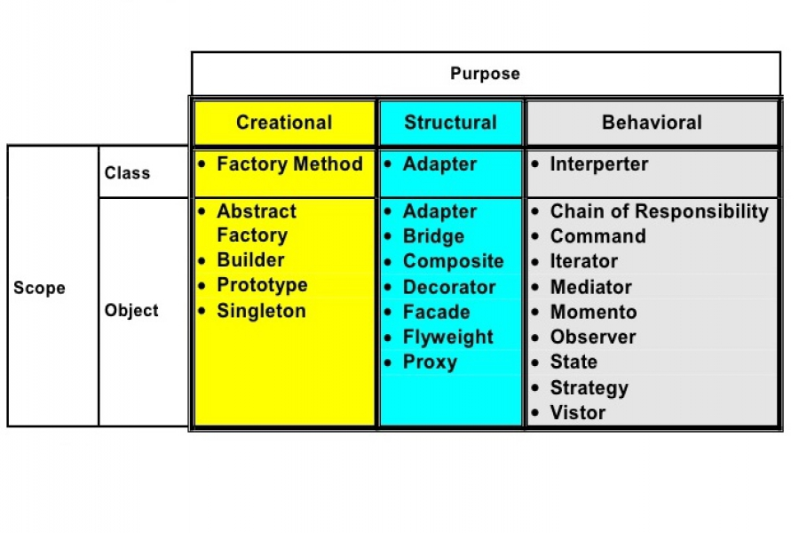

Imagine a grand symphony hall, where talented musicians play their instruments in perfect harmony. Just as music arrangements bring together these individuals to create an exceptional concert, design patterns fulfill a similar role in the programming world. They ensure smooth collaboration, neatness, and avoid clutter caused by multiple versions. One such pattern, the Singleton, facilitates resource management and global accessibility by creating a single instance of a class and providing a centralized access point.

When exploring Structural Patterns like Adapter and Bridge, the programming journey becomes even more captivating. The Adapter pattern assumes the role of a master sculptor, harmonizing disparate interfaces. Just as a sculptor seamlessly combines different materials to create a cohesive composition, the Adapter pattern enables incompatible classes to collaborate seamlessly. It acts as a bridge, adapting the interface of one class to match the expectations of another, promoting code reusability and enabling the integration of otherwise incompatible components or systems.

The Observer pattern adds another layer of interest as a steadfast companion, ensuring synchronization in my code. By establishing a publisher-subscriber relationship, it enables efficient communication and event handling. Observers notify and react to changes, promoting loose coupling and maintaining system integrity. This pattern enhances the modularity and maintainability of the codebase.

When asked about the design patterns I employ, my thoughts immediately turn to my buddies: Factory Methods, Adapters, Observers, and Strategies. Factory Methods for creating protocols, Adapter for bridging gaps, Observers for keeping things in sync, and Strategies for picking the right move. These patterns have become part of how I write code, not just solutions, but like shortcuts that make my code smarter and neater. They serve as valuable shortcuts that enhance the intelligence and organization of my codebase, allowing me to create modular, extensible, and maintainable software solutions.

