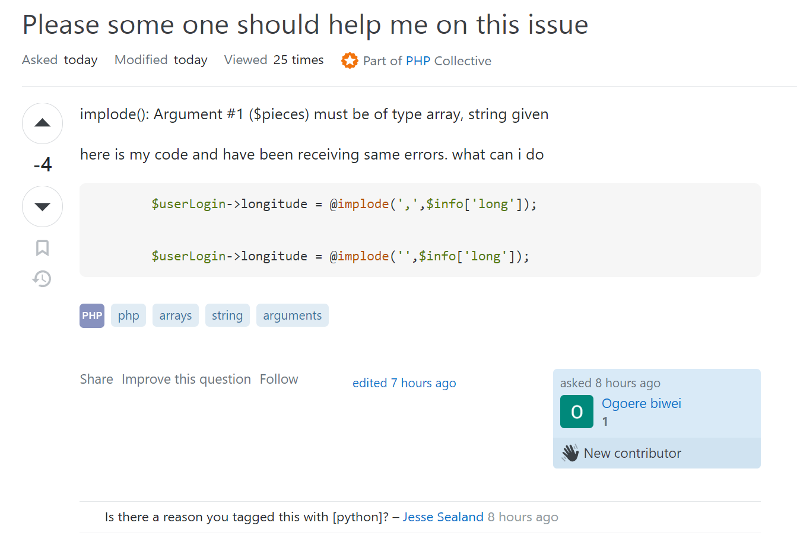

As a software engineer, we always have issues with programming and finding solutions to resolve problems. Every project, big or small, has its own set of difficulties and requires a separate solution. And of course, we can search for solutions on Google or other search engines. However, sometimes we don't get the answers we want, so Stack Overflow is a community for developers that can help each other with industry issues. Stack Overflow is a very useful playground to learn new knowledge, but accomplishing everything requires techniques to optimize our time and effort. After taking a quick look at Eric Steven Raymond's "How To Ask Questions The Smart Way," I realized how important it is to ask questions in order to get optimal answers.

<h3>What does "dump" question look like ?</h3>

To make it easier to understand, I will give an example that I found on Stack Overflow. A post was asked by user Ogoere Biwei with the title "Please, someone should help me on this issue." Right from the title, we can see the ambiguity in stating the problem. According to Eric Steven Raymond, providing subject headers in the form of "object - deviation" helps us organize our thinking about the problem in more detail. From a reader's point of view, I have no idea what problem Ogoere is in need of help with.

When I clicked open this post, I saw a more detailed question as shown below:

We can see that the wording of the question is also unclear. He wanted to ask about the function implode(). According to Eric Steven Raymond, before we ask the question, let's try searching through the search engines. Searching for the function implode() on Google brings up a lot of results with available examples that are very intuitive. I think the problem will be solved much faster this way.

Secondly, he shows two lines of code and mentions that he has been receiving the same errors. However, he does not mention what error he is encountering. Additionally, he does not provide a clear desired output, which makes it difficult for other users to give reasonable answers and help him get solutions faster.

Finally, we can see responses like 'Is there a reason you tagged this with [python]?' Providing false information, such as including the Python tag when the question is related to PHP, can result in our question not being answered effectively and can waste time for all parties involved. And of course, this post received 4 downvotes.

<h3>Try Smarter</h3>

     
Now let's take a look at a smart question. Let's start with the title: as we can see, it's much clearer than the one above. We can tell that the user is having problems with async/await and array.map. This will help us find the right people to address the problem more quickly.

Next, as we can clearly see in the image above, the author of the post provides an example of their code along with the error they encountered. This gives everyone enough information to work with and helps others with the same problem find the answer more easily.

Finally, the author clearly states their need for help making async/await work with array.map. Providing a clear output like this will help subject matter experts give a better answer more quickly. It's worth noting that this question received 515 upvotes, which means that many other people have benefited from it.
