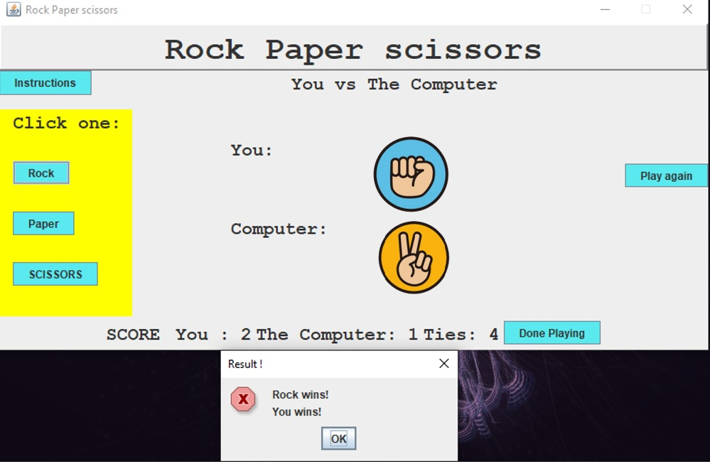

Rock Paper Scissors is one of the projects I developed in my ICS 211 class. By implementing Java Swing, a toolkit that helps us create user interfaces on the Java platform, this project helped us practice with event handlers to implement Action listeners, allowing users to directly manipulate the software through buttons, text, and user feedback. In this game, the user plays against the computer, and they can choose between rock, paper, or scissors. The results are saved as a .txt file in the same directory.

<h3>Project detail</h3>

Starting the game, we will see the game interface as shown below. On the left side of the panel, we will see four options: instructions, rock, paper, and scissors. In the middle of the panel, the player's selection will appear. To the right of the panel, there are two options: play again and exit. Finally, below the panel, there will be the player's score and the computer's score.
After the player chooses one of the three options, the system will randomly choose the computer's choice. Based on the rules of the classic rock, paper, scissors game, it will be determined who wins. A new panel will then pop up to announce whether the player has won or lost.

