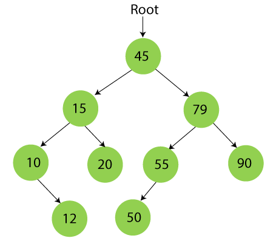

This is one of my projects in class ICS 211. This project involves storing albums and includes information such as the album name, artist, price, and number in stock. Through this project, I gained experience in understanding how Object-Oriented Programming (OOP) works in Java. Additionally, it incorporates a binary search tree node data structure to store CDs within albums. I have also implemented exceptions to ensure that the program continues to function correctly in the presence of logic problems.

Upon completing this project, I have acquired a comprehensive understanding of Java's object-oriented programming concepts. The knowledge I have gained spans from the fundamentals of Java, such as basic syntax and object manipulation, to more advanced topics like handling exceptions effectively. Throughout my journey from ICS 111 to ICS 211, I have delved into various aspects of programming, including the implementation of data structures like binary trees. Overall, my journey from ICS 111 to ICS 211 has been transformative. I have not only acquired a solid understanding of Java's object-oriented programming principles but also developed the skills to tackle real-world programming challenges. From basic Java concepts to advanced topics like exceptions and data structures, I am now equipped to write elegant, efficient, and robust code in Java.
